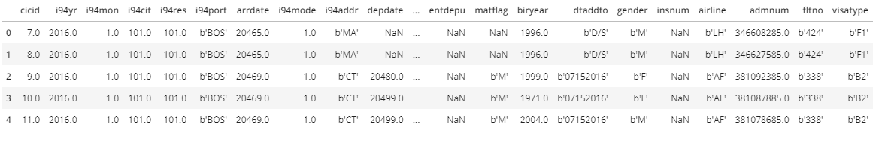
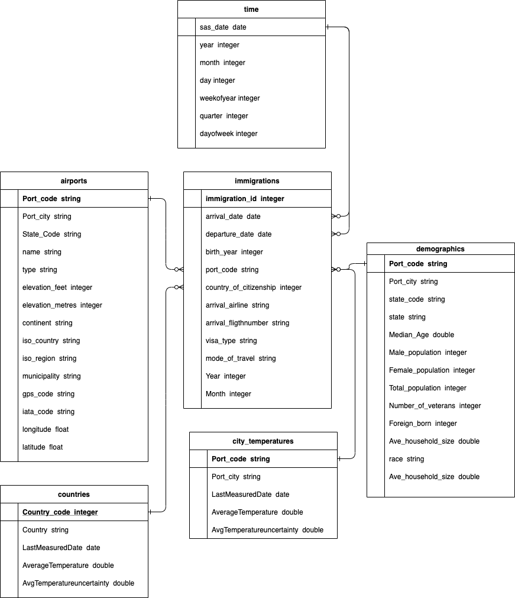

# Project: Data Engineering Capstone Project - Enable analysis of US Immigration, airport and city demographics data

## Introduction
It was decided to use the Udacity provided project raw data files for this project. 

### Summary of Datasets

|Dataset|Source of Dataset|Format|Filenames|Data Dictionary|
|:-------|-----------------|------|--------|---------------|
|I94 Immigration Data|US National Tourism and Trade Office; https://www.trade.gov/national-travel-and-tourism-office via Udacity|SAS|*i94_monYY_sub.sas7bdat*  where *mon* is the three-letter abbreviation for the month name and *YY* is the year |I94_SAS_Labels_Descriptions.SAS|
|Airport Codes|https://datahub.io/core/airport-codes#data | CSV|*airport-codes_csv.csv*|https://ourairports.com/help/data-dictionary.html|
|U.S. City Demographic Data|https://public.opendatasoft.com/explore/dataset/us-cities-demographics/export/| CSV |*us-cities-demographics.csv*|https://public.opendatasoft.com/explore/dataset/us-cities-demographics/information/|
|World Temperature Data*|https://www.kaggle.com/berkeleyearth/climate-change-earth-surface-temperature-data via Udacity| CSV|*GlobalLandTemperaturesByCountry.csv* and *GlobalLandTemperaturesByCity.csv*|https://www.kaggle.com/berkeleyearth/climate-change-earth-surface-temperature-data|
|i94 Port codes|Extracted from data dictionary I94_SAS_Labels_Descriptions.SAS provided by Udacity| CSV|*i94_ports.csv*|I94_SAS_Labels_Descriptions.SAS|
|i94 countries|Extracted from data dictionary I94_SAS_Labels_Descriptions.SAS provided by Udacity| CSV|*i94_countries.csv*|I94_SAS_Labels_Descriptions.SAS|
*-Probably need to signin to Kaggle.

## Project Description
The aim of this project is to build an ETL pipeline to extract data from the above mentioned files, process them using Spark and then
create a set of dimensional tables in a datalake, this will allow analytics teams to find insights regarding US visitors and the airport/city
they arrived. The output will be written as a set of parquet files in a separate analytics directory. Each table has its own folder within a directory.
The pipeline does some cleaning, validation and enriching of the data.
Only certain columns regarding the visitors are used from the immigration file; such as age, country of citizenship, arriving date, visa type, flight details and arriving airport. But this should give enough detail to provide data for finding insights into US visitors, that could be used for example by a tourism related business or perhaps a researcher.

 ### Example use cases:
 - Find the most popular arrival cities per month or maybe per week 
 - Which are the most popular countries of citizenship of the arrivals per month for a particular city/port?
 - Is there any correlation between the count of foreign born residents of the arriving city and the visitors?
 

## Dataset overview

 - ### US I94 immigration Data 
   This file will be used as the base to build the data model.
   Immigration data is in SAS7BDAT format, files contain data for one calendar month and each file has about 3 million rows.
   There are 28 columns and some of the columns contain nulls.
   Example data:

 - ### Airport Codes
   Holds detailed information about airports worldwide.
   Contains just over 55,000 rows, but will only be selecting open US airports in this project.
   There are 12 columns and some columns are null.
   
 - ### U.S City Demographics
   Holds detailed demographics information about US cities
   Contains about 3000 rows and 12 columns.
   
 - ###  World Temperature Data
   Holds average temperatures for countries and cities throughout the world since 1743 until 2013
   If downloaded from the above mentioned link, the file per city is quite a large; about 573MB.
   This project will only use the file per country, but city file could be used for example to find the average
   temperature for the arriving airport/city.
   
 - ### i94 Port Codes
   These codes with their respective city names and state codes were extracted from the US I94 Immigration data dictionary
   file I94_SAS_Labels_Descriptions.SAS provided by Udacity and placed in csv file. 
   There are about 660 rows and 3 columns in the csv file.
   
 - ### i94_countries
   These code with their respective country names were also extracted from the US I94 Immigration data dictionary file 
   I94_SAS_Labels_Descriptions.SAS provided by Udacity and placed in csv file. 
   There are about 289 rows and 2 columns in the csv file.

## Data cleaning, enriching and validation.

   The following data cleaning steps are done in the ETL process.
   Deduplication, enriching and filtering are done to ensure some level of data quality.
   
   Duplicates were addressed by only selecting distinct rows from the source files.
   The arriving and departure dates in the immigration file were converted from the SAS format; stored as days since 1/1/1960, 
   to a more convenient *date* format that can be queried easily. Also a separate *time* dimension table is created
   from the arriving and departure dates.
   The *mode of travel* and *visa type* from the immigrations file are converted from codes to a more informational description.
   The descriptions are from the data dictionary file I94_SAS_Labels_Descriptions.SAS
   
   Separate longitude and latitude values were extracted from the *coordinates* column in the Airport Codes file, this might prove
   helpful for analysis queries. Also, a column was added to the airport table containing the elevation in metric units, (metres; rounded
   up), converted from *elevation_ft* column.
   
   A few columns in the I94 immigrations data file e.g. *occup*, *entdepu* were dropped because they contain a majority of nulls and some column
   names were renamed to be more descriptive.
   
   The number of rows read from the source file is collected, this could be used to check for problems with the extraction step.
   Only the primary key columns are checked for nulls and if nulls found then the rows are filtered out. It might be possible to check all
   columns in each file for nulls, but this would probably effect performance.
   
   
## Data Model

A Star Schema was chosen and implemented using the following fact and dimension tables:
  Fact Table:
-  *immigrations* - populated from SAS file provided by US National Tourism and Trade Office via Udacity
  
  Dimension Tables:
-  *time* - created and populated from arrival and departure date columns of the immigrations file, decomposed into specific time units.
-  *airports* - created and populated from I94 port data file and the more detailed airport_codes file.
-  *demographics* - created and populated from the city demographics file provided by opendatasoft.com and the I94 port data file
-  *countries* - created and populated from the i94 country codes and descriptions joined to the country temperature file provided by 
   Berkeley Earth via Kaggle.com
-  *city_temperatures* - created and populated from i94 port data file and city temperature file provided by Berkeley Earth via Kaggle.com
  

### Diagram of data model

### Data Dictionary

   #### immigrations

|Field|Type|Description|
|:----|-----|-----------|
|immigration_id|integer|Primary Key, original column *cicid* is used and renamed|
|arrival_date|date not null|converted from the SAS format|
|departure_date|date not null|converted from the SAS format|
|birth_year|integer|Visitors birth year|
|port_code|string|Three character code identify a city/port, foreign key to table *airports*|
|country_of_citizenship|integer|Foreign key to table *countries*|
|arrival_airline|string|Airline code of arriving flight|
|arrival_fligthnumber|string|Number of arriving flight|
|visa_type|sting|Visa type description held by arriving visitor|
|Year|integer|Arrival year|
|month|integer|Arrival month|

   #### time
|Field|Type|Description|
|:----|-----|-----------|
|sas_date|date|Arrival or departure date, foreign key to table *immigrations*|
|year|integer|Year part of the sas_date|
|month|integer|Month part of the sas_date (1-12)|
|day|integer|Day part of the sas_date (1-31|
|weekofyear|integer|Week number (1-52|
|quarter|integer|Quarter of the year (1-4|
|dayofweek|integer|Day of the week, starting Sunday (1-7|

   #### airports
|Field|Type|Description|
|:----|-----|-----------|
|Port_code|string|Three character code used to identify a city/port|
|Port_city|string|Name of city/port|
|State_code|string|Two letter US state code, only cities/ports in US are populated|
|name|string|Name of airport|
|type|string|Brief description of the type of airport|
|elevation_feet|integer|Height of the geographic location, in imperial units|
|elevation_metres|integer|Height of the geographic location, in metres, converted from feet, rounded-up to the nearest metres|
|continent|string|Two letter code for the continent|
|iso_country|string|Two letter ISO code for the country|
|iso_region|string|ISO region code|
|municipality|string|US municipality|
|gps_code|string|airport GPS code|
|iata_code|string|International Air Transport Association code of airport|
|longitude|float|longitude coordinate of airport|
|latitude|float|latitude coordinate of airport|

  #### demographics
|Field|Type|Description|
|:----|-----|-----------|
|Port_code|string|Three character code used to identify a city/port|
|Port_city|string|Name of city/port|
|State_code|string|Two letter US state code, only cities/ports in US are populated|
|State|string|Name of US state|
|Median_age|double|Mediation Age of the demographic |
|Male_population|integer|Count of male population of the city|
|Female_populaton|integer|Count of female population of the city|
|Total_population|integer|Total population count of the city|
|Number_of_veterans|integer|Count of veterans for the city|
|foreign_born|integer|Count of foreign born persons in the city|
|Ave_household_size|double|Average household size of the city|
|race|string|race of the demographic for the city|
|count|integer|Total count of demographic|

  #### countries
|Field|Type|Description|
|:----|-----|-----------|
|country_code|integer|Primary Key; Three digit code used to identify a country|
|country|string|Name of country|
|LastMeasuredDate|date|The most recent date the average temperature data was measured|
|AverageTemperature|double|Average temperature of the country for the date|
|Avetemperatureuncertainty|double|Average temperature uncertainty of the country for the date|

 #### city_temperatures
|Field|Type|Description|
|:----|-----|-----------|
|Port_code|string|Primary Key; Three character code used to identify a city/port|
|Port_city|string|Name of city/port|
|LastMeasuredDate|date|The most recent date the average temperature data was measured|
|AverageTemperature|double|Average temperature of the country for the date|
|Avetemperatureuncertainty|double|Average temperature uncertainty of the country for the date|

## ETL pipeline
Prerequisites
- Python3 is recommended as the environment. Probably the most convenient way to install python is to use Anaconda (https://www.anaconda.com/distribution/.
- Pyspark (+ dependencies) to enable script to create a SparkSession. (See https://spark.apache.org/docs/latest/api/python/pyspark.sql.html)- 
NOTE: saurfang:spark-sas7bdat package required to enable Spark to process SAS files.

- dl.cfg - holds the folder names where the source data files reside and the destination output folder names.

Python script: etl.py *no parameters/arguments required*

Overview of process:
 - Runs Apache Spark SQL commands to read source data (SAS and csv files) from local folders to memory as Spark DataFrames.
 - Data is further changed using DataFrames in memory.
 - The DataFrames are saved locally as Spark parquet files.

Details:
- Script firsts reads in configuration settings from file dl.cfg
- Each source file is read into a dataframe and a temporary view is created.
- For the csv source files, option; *inferSchema="true"* is used to retain the header names.
- The i94_ports csv is imported before the city, demographics and airport files are read.
- For the city and country temperature files, only the most recent rows per city or country are selected.
- Parquet files are created as output, each table as its own folder.
- Script prints out information about the progress of the script execution.

### Suggested schedule
ETL could be run once per month, assuming an i94 immigration file is available for download. Perhaps the script could be scheduled to run everyday and a check done for the latest available immigration file.
The temperature files are date dependent, a row per day, but it depends when the data is available for download.
Other data such as airports codes are probably not going change that often, but can imported again without problem, because the file is small.

 
#### Rationale for database, ETL design and tools selected.
Star schema was chosen because its simple design of separate business data in the fact table 
with supporting dimension tables is relatively easy to create. It allows simple and fast queries to be built
over the data.

Collecting the input data from desperate sources, then processing the data when required, and writing to a datalake 
without maintaining a separate database with intermediate or final data is flexible and probably cheaper
than creating and maintaining a database such as POSTGRESQL. Also resources for processing are only
required when data processing.
A separate schema is not required as Spark creates the schema.
Spark processes are in memory and can be in parallel, so should be fast.
Python and Spark contains all the necessary libraries to read, clean, process, and create Data tables, plus are
easy to use.
The data set is limited, local and server storage was used in storing, reading, writing the input and output data.
However source data and output data could have been stored in AWS without any major problems.

#### Other real world scenarios:

Data is 100x bigger:
- Input source data should be stored in a cloud storage such as; AWS S3.
- Clustered Spark session should be enabled so data is processed in parallel.
- Output data (parquet files) should be stored in a Cloud storage such as AWS S3 or maybe to a Cloud DB for example 
  AWS Redshift or some cheaper Database (e.g. AWS RDS).
- The immigration data is provided in files one per month, but could partitioned by day, and then back-filled    through an Apache Airflow pipeline, a day at a time.

If the pipelines were run on a daily basis by 7am.
- The pipeline should set to run daily. Apache Airflow could be used and set-up to run at a certain time of the day and create an SLA in Airflow to ensure jobs are completed on-time.

If the database is needed to be accessed by 100+ people.
- Output data should be stored in a Cloud Database such as AWS RDS to ensure its always available. Maybe introduce some tools for the end-users to access the database.
- New summary tables could be created to help with the most used queries.

#### Potential enhancements to this process:

- More logging introduced to the ETL script, to check errors and performance. 
- Additional parameters in the functions, such as file format and column separator.
- Change the immigrations import so collects files per month.

 
 